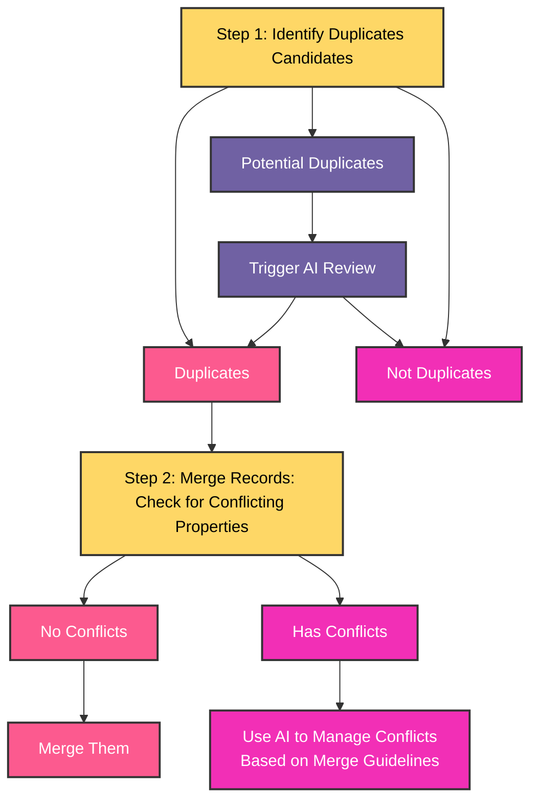

# Extraction Runs

## Overview

Extraction Runs are the core processing job that transforms your document collections into structured knowledge graphs using an ontology. An Extraction Run takes a collection of documents and applies an ontology to systematically extract entities and their relationships, creating a queryable knowledge base.

**Think of an Extraction Run as an intelligent processing job** that reads through all your documents, identifies the information defined by your ontology (people, companies, events, etc.), and organizes everything into a structured graph that you can query and analyze.

## Core Concepts

### What is an Extraction Run?

An Extraction Run is a multi-step pipeline that:
- **Processes Document Collections**: Takes a collection of documents as input
- **Applies an Ontology**: Uses your ontology to guide what information to extract
- **Creates Knowledge Graphs**: Builds a structured representation of information from your documents

Once you are satisfied with your extraction results, turn them into a Knowledge Base to make them queryable by AI agents. 

## Extraction Run Pipeline

### Pipeline Stages

Every Extraction Run follows a systematic multi-stage pipeline:

#### 1. **Chunking Stage (Optional)**
Documents are broken down into manageable pieces.

It is recommended to only use chunking for very long documents containing a lot of entities. Start without it, and use it if your extraction feels incomplete!

**Available chunking methods:**
- **Character-based chunking**: Split text into segments with a maximum character count (e.g., 1500 characters)
- **Semantic chunking (coming soon)**: Use AI to create meaningful content segments based on guidelines you provide

#### 2. **Extraction Stage**

**Entity and Relationship Extraction:**
- Identifies instances of entity types and their relations, as defined in your ontology
- Configurable with custom extraction guidelines in "Advanced parameters"
- Can extract either from document-level or from chunks resulting from the previous pipeline step. 

**Advanced Features:**
- **Custom Guidelines**: Provide specific instructions. Use it only for guidelines that are very specific to your collection and must not be included directly in your ontology. 
- **Think before extraction**: Enable detailed reasoning explanations for extractions (the chain-of-thought will appear in the results, useful to learn how the AI interprets your guidelines or documents)
- **Reflect on extracted items**: Apply additional validation to extracted entities (the self-reflection will appear in the results)

We use caching techniques so that changing one class in your ontology and re-launching the extraction doesn't recompute all the results for the other untouched classes. The goal is that you work iteratively on your ontology to refine it, based on your extraction results!

#### 3. **Deduplication (Optional)**

Deduplication is a two step process:
- First, identify potential candidates.
    - For obvious duplicates (typically if a strong identifier matches exactly), go straight to the merging step.
    - For not-so-obvious cases (typically if two company names fuzzy match, such as Tesla and Tesla,Inc), trigger an AI review. The AI considers all the entity properties and decides if two entities must be considered duplicates or not. 
- When two entries have been detected as duplicates, records need to be merged.
    - If they don't have conflicting properties, merge them.
    - If they have conflicts, use AI to manage them, based on your merge guidelines.
  

#### 4. **Results** 
When you are satisfied with the results, you can **create a Knowledge Base**:
- Makes the extraction run results permanent
- Enables querying and analysis fo your results with AI

## Usage Monitoring
- Check LLM usage insights in extraction run status
- Smaller chunks and more entity types increase processing costs
- "Think before extraction" and "Reflect on extracted items" in the extraction parameters add processing overhead

## Best Practices

**Start Simple:**
- Begin with a small document collection to test your ontology
- Run extraction on a subset of entity types first
- Iterate on your ontology based on extraction quality
