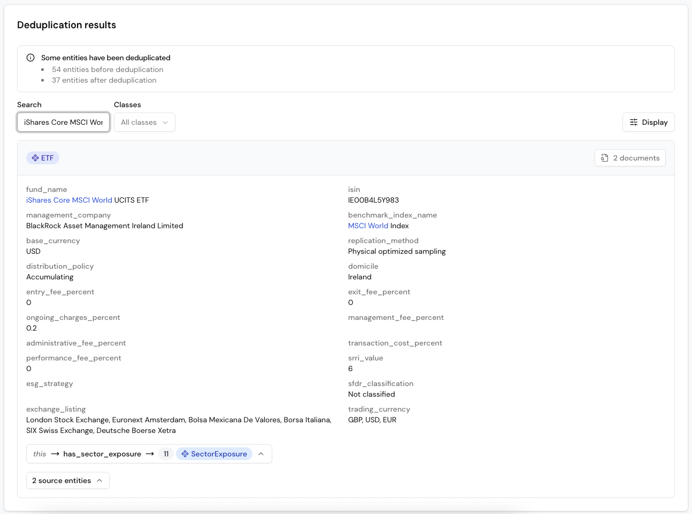

# Analyze ETFs with Blue Morpho

Information on ETFs such as fees, structure, or ESG criteria is often buried in unstructured documents. Blue Morpho lets you model the key data points once and extract them consistently across all documents, making comparison and analysis easy.

In this tutorial, we will answer questions about three different ETFs using their KID and Factsheet documents.

## **Step 1: Create a project**

Every workflow in Blue Morpho begins with a **project**. A project organizes your collections, ontologies, extractions, and knowledge bases so all related work stays in one place.

1. Go to **Projects**.  
2. Click **New Project**.  
3. Enter a name (e.g. “ETF Analysis”) and a short goal (e.g. “Automate analysis of multiple ETFs”).
4. Click **Create**.

## **Step 2: Create a collection**

A collection is a set of documents analyzed with the same ontology. You can upload PDFs (automatically parsed into text) or TXT files (ingested directly). Parsing time depends on the file size and number of documents.

1. Go to **Collections**.  
2. Click **New Collection**.  
3. Enter a name (e.g. “ETF Documents”) and a short description (e.g. “Factsheets and KIDs for ETFs”).  
4. Upload the 6 sample PDFs provided in [this ZIP file](https://github.com/getbluemorpho/blue-morpho/raw/refs/heads/main/docs/assets/tutorial-analyze-ETFs/tutorial-analyze-ETFs-PDFs.zip) for this tutorial.
5. Click **Create**

**Note:** The dataset includes both KID and Factsheet PDFs for three ETFs. These are for demonstration only and not for financial use.

## **Step 3: Create an ontology**

An ontology defines the structure of your data: what entities exist, their properties, and how they relate. Think of it as the blueprint for organizing knowledge extracted from your documents.

ETF documents include hundreds of data points, from detailed portfolio holdings to complex derivative exposures. In this tutorial, we’ll focus on a few essential elements to keep the model clear, practical, and easy to follow.

We will therefore create the following objects:

**Entities**

* **ETF:** Name, ISIN, management company, benchmark index, replication method, ESG approach, fees, SRRI, and trading details.  
* **Sector:** Basic investment categories (e.g. “Health Care”, “Technology”).  
  **SectorExposure:** Links ETFs to sectors, with attributes for *date* and *weight percentage* (e.g. “15.3% in Healthcare”).

**Relationships:**

* ETF → has\_sector\_exposure → SectorExposure  
* SectorExposure → references → Sector

This allows queries such as: *“What’s the average technology exposure across all ETFs?”*

**Create the Ontology in Blue Morpho**

You can create an ontology manually or use the ontology assistant. For this tutorial, we’ve already prepared one for you to import.

1. Go to **Ontologies**.  
2. Click **New Ontology**.  
3. Enter a name and description (e.g. “ETF analysis ontology”).  
4. Choose **Import from YAML file** and upload this ontology template: [ETF analysis ontology](https://github.com/getbluemorpho/blue-morpho/blob/main/docs/assets/tutorial-analyze-ETFs/ETF_analysis_ontology.yaml)   
5. Click **Create**

### **Explore your ontology**

After importing, you’ll see your ontology as a list of entities and relationships.

You can add short natural language descriptions to each entity, property and relation to capture their meaning in your business context. These descriptions enrich the ontology with contextual knowledge, helping the agent give grounded answers. Blue Morpho also uses them during extraction to accurately identify and map the right information from your documents, even when wording or terminology varies.

Review the entities and their properties, especially those related to ETFs.


## **Step 4: Run an extraction**

Now let’s extract data from your ETF documents based on your ontology.

1. Go to **Extraction Runs**.  
2. Click **New Run**.  
3. Add a name (e.g. *“ETF extraction”*) and a description (e.g. *“Extract key ETF information from Factsheets and KIDs”*).  
4. Select your **Ontology** (*“ETF analysis ontology”*) and your **Collection** (*“ETF documents”*)  
5. Click **Create**  
6. Add an **Extraction step** with the default settings and click **Extract**.

### **Review your extraction results**

The Results view lists all extracted ETF information from your Factsheets and KIDs, along with the related sectors and the SectorExposure entities linking ETFs to sectors.

For example, search for “**iShares Core MSCI World**” to compare the data Blue Morpho extracted from its KID and Factsheet.


This step helps you verify that Blue Morpho correctly extracted the information, created the entities and relationships, and lets you adjust the ontology if needed.

Once the extraction results look correct, move on to deduplication:

* Scroll back up and click **Deduplication (optional)**

### **Deduplicate extraction results**

Deduplication merges identical entities extracted from multiple sources, preventing duplicates in your knowledge base.

In this tutorial, you’ll notice duplicates for:

* **ETFs** since information comes from both Factsheets and KIDs  
* **Sectors** since a single sector may appear in multiple ETFs

To deduplicate:

1. Click **Add class to deduplicate entities**  
2. Select **ETF** and **Sector**

In this case, the deduplication process is straightforward, and Blue Morpho can handle it without additional configuration:

3. Click on **Generate rules** without adding any guidelines  
4. Click on **Deduplicate** 

### **Review your deduplication results**

Scroll down to review the deduplication results.

Using the **“iShares Core MSCI World”** example, you’ll now see a single ETF entity combining properties from both source entities (the KID and the Factsheet). The resulting entity references both original documents.



For **Sector** entities, you’ll notice that Blue Morpho merged variations such as *“Financial services”* and *“Finance”* into a single standardized *“Financials”* sector. This ensures consistent analysis of sector exposure across all ETFs.

You can guide the deduplication process by defining preferred final names in the “Guidelines for detecting duplicates.”  
*Example: “Deduplicate all financial services–related sectors into a single sector named ‘Financial services.’”*


## **Step 5: Create a Knowledge Base**

Once extraction and deduplication look correct, turn them into a Knowledge Base so you can query them.

1. In the **Extraction Results** view, click **Create Knowledge Base**.  
2. Add a name (e.g. *“ETF analysis KB”*) and a description (e.g. *“Knowledge Base ETF information”*).  
3. Click **Create**.

## **Step 6: Query your Knowledge Base**

With your Knowledge Base ready, you can now ask questions in plain language. Each query is automatically translated into a structured search based on your ontology and the data extracted from your ETF Factsheets and KIDs.

1. Go to **Knowledge Bases**.  
2. Select your **Knowledge Base (**“*ETF analysis KB*”**)**.   
3. At the top right, click on **“Ask”** to start a chat with your knowledge base

### **Example 1 \- Find ETFs**

Quickly identify which ETFs match your specific criteria, even if you don’t use the exact terminology.

```
Show me the ETF with the best environmental characteristics, limited risks and requiring minimum management from me
```


### **Example 2 \- Analyze portfolio sector exposure**

Compare the sector exposure of your selected ETFs using the latest available data.

```
Compare sector exposure across all my ETFs
```


### **Example 3 \- Compare fees between ETFs**

Compare specific cost criteria across all ETFs in your portfolio or selection.

```
Compare total fees across all ETFs.
Format as a table with columns: ETF | Entry fees | Transaction fees | Other fees | Exit fee
```

****  
You can also ask follow-up questions to explore the details:

```
Show me the detailed fee structure for BNP PARIBAS EASY MSCI EMU SRI PAB.
```


## Next steps

You now have a working ETF analysis workflow.

You can:

* Add new ETF Factsheets and KIDs to your collection to expand your analysis.  
* Extend the ontology to include more dimensions, such as geographic exposure, equity exposure, currency risk, or protection mechanisms.

Continue exploring Blue Morpho with these next steps

* **Analyze other financial products:** Adapt the ontology to study corporate bonds, mutual funds, or other instruments.  
* **Consolidate investment portfolios:** Follow the [*Investment portfolios* tutorial](https://docs.getbluemorpho.com/tutorials/consolidate%20investment%20portfolios/) to combine financial reports into a single knowledge base.  
* **Integrate through [MCP](https://docs.getbluemorpho.com/product/core%20concepts/5.%20setup%20blue%20morpho%20mcp/):** Query your Knowledge Base directly from your own environment..
