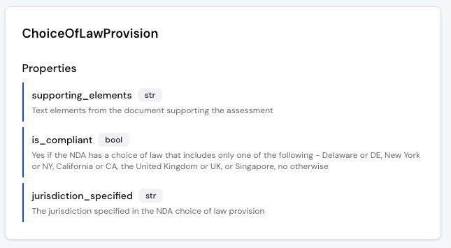
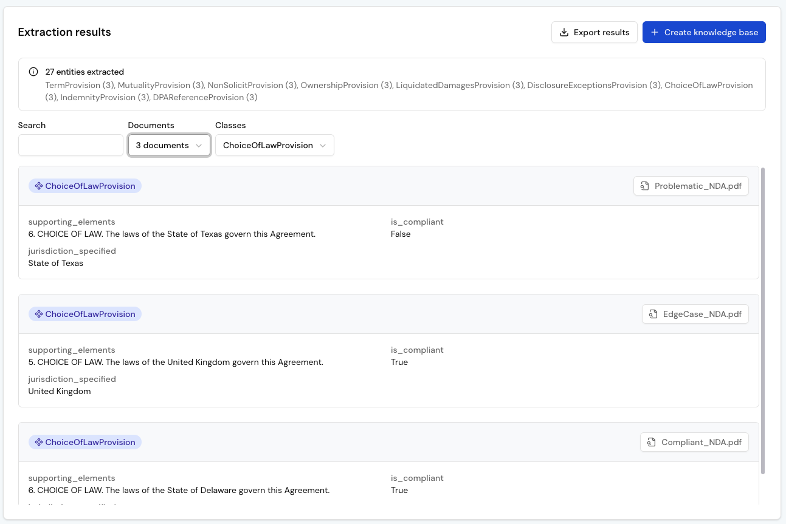
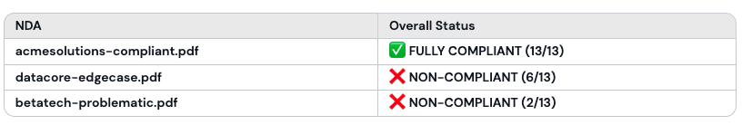
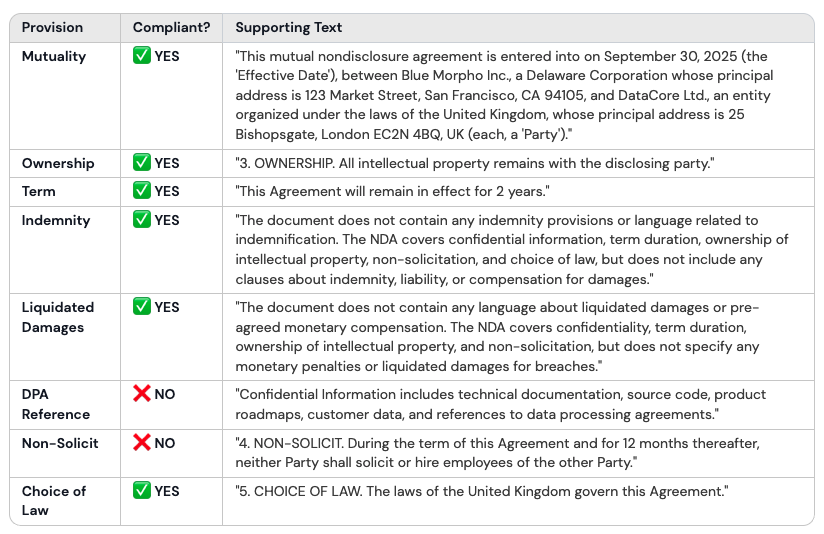
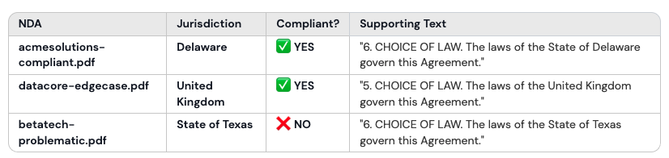
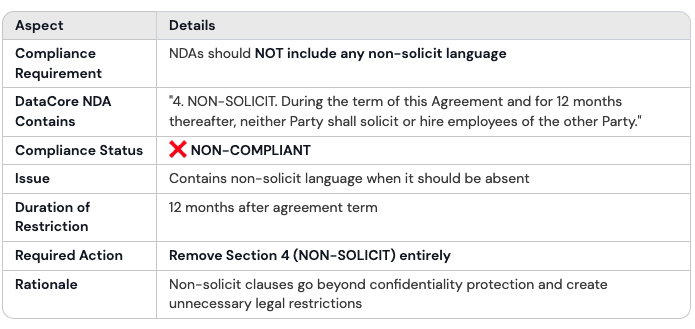
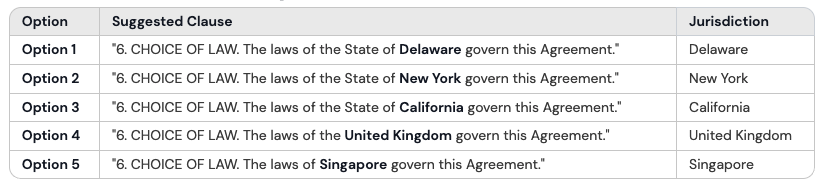

# Automate NDA Compliance

Legal teams spend hours reviewing NDAs for the same checklist of rules: is it mutual, does it preserve ownership, does it specify an approved jurisdiction. With Blue Morpho, you can automate this process by modeling those rules once and applying them consistently across every contract.

In this tutorial, you’ll follow along with three sample NDAs to see exactly how it works.

## **Step 1: Create a project**

All your work in Blue Morpho starts inside a project. A project groups together collections, ontologies, extractions, and knowledge bases, so everything related to one use case stays in the same workspace.

1. Go to Projects.  
2. Click New Project.  
3. Add a Name (e.g. *“NDA Compliance”*). 
4. Add a Description (e.g. *“Automate compliance checks across our NDAs”*).
5. Click Create.

## **Step 2: Create a collection**

A collection is a folder of documents processed with the same ontology. You can upload files as PDF, which are automatically parsed into text (markdown), or as TXT, which are ingested directly. Parsing may take a few minutes depending on the number and size of the files.

1. Go to Collections.  
2. Click New Collection.  
3. Add a Name (e.g. *“NDA Compliance Docs”*).
4. Add a Description (e.g. *“Collection of active NDAs signed with partners.”*).  
4. Download the [sample dataset](https://github.com/getbluemorpho/blue-morpho/blob/main/docs/assets/tutorial-nda-compliance/tutorial-nda-documents.zip) and upload the NDAs files. 
5. Click Create

**Note:** The dataset contains three different NDAs: one fully compliant, one problematic with multiple red flags, and one edge case that looks fine at first but includes unusual clauses.

These NDAs are synthetic examples generated from the open-source [Universal NDA template](https://github.com/bitmovin/unda). They are for demonstration purposes only, not for legal use.

## 

## **Step 3: Create an ontology**

In this use case, the ontology works a bit differently. Instead of modeling entities and their relationships, it serves as a set of compliance rules.

Each provision you want to verify, such as mutuality, ownership, or choice of law, becomes a class. The properties within each class define how compliance is checked and where the supporting evidence is found in the NDA.

Since each clause can be evaluated independently, relationships between classes are not needed. The ontology functions as a checklist of rules, each connected to the exact text that supports the result.

1. Go to Ontologies.  
2. Click New Ontology.  
3. Add a Name (e.g. *“NDA Compliance Ontology”*). 
4. Add a Description (e.g. *“Ontology to check NDA provisions against internal rules”*).  
5. Click Create
6. Click Import from YAML
7. Download the [sample NDA ontology](https://github.com/getbluemorpho/blue-morpho/blob/main/docs/assets/tutorial-nda-compliance/tutorial-nda-ontology.yaml) and import the YAML file. 
8. Click Create


### **Explore your ontology**

After importing, you’ll see your ontology displayed as a list of provisions. Each one represents a class (e.g. ChoiceOfLawProvision) with properties that define how compliance is determined.



* **supporting\_elements**: captures the text from the NDA that justifies the decision.  
* **is\_compliant**: encodes your business rule (e.g. which jurisdictions are approved).  
* **jurisdiction\_specified**: captures the jurisdiction explicitly named in the NDA.

## **Step 4: Run an extraction**

With your NDAs and ontology ready, the next step is to apply the rules and extract structured results.

1. Go to Extraction Runs.  
2. Click New Run.  
3. Add a Name (e.g. *“NDA Compliance Extraction”*).
4. Add a Description (e.g. *“Run to check NDA provisions against compliance ontology”*).  
5. Select your Ontology (*“NDA Compliance Ontology”*).
6. Select your Collection (*“NDA Compliance Docs”*)  
6. Click Create  

**Configure the pipeline**

1. Skip Chunking - not needed for NDAs.  
2. Add an Extraction step - keep the default settings. 
3. Click Extract.  
4. Click on Deduplication
5. Skip Deduplication - not needed for NDAs.  
5. Click on Results 

### **Review your results**

The results view lists all extracted provisions from your NDAs, showing each provision’s class, properties and source document. This is where you can see how your ontology was applied across all documents.

Use this view to validate your extraction. Check that the results follow the rules defined in your ontology and that the supporting text accurately reflects the clause in the NDA. If something doesn’t look right, adjust the ontology and rerun the extraction to improve accuracy.



## **Step 5: Create a knowledge base**

After reviewing your extraction results, create a knowledge base to make them queryable.

1. In the Extraction results view, click Create knowledge base.  
2. Add a Name (e.g. *“NDA Compliance KB”*).
3. Add a Description (e.g. *“Knowledge Base of NDA compliance results”*).  
3. Click Create.

## **Step 6: Query your knowledge base**

With your knowledge base ready, you can now ask questions in plain language. Each query is translated into a structured search based on your ontology and the supporting text extracted from your NDAs.

1. Go to Knowledge Bases.  
2. Select your knowledge base (“*NDA Compliance KB*”).   
3. At the top right, click on “Ask” to start a chat with your knowledge base

### **Example 1 \- View overall compliance**

See at a glance which NDAs are compliant overall and which are not.

```
Show me all NDAs with their overall compliance status. 
Format as a table with columns: NDA | Overall Status
```



### **Example 2 \- Audit a single NDA**

Drill down into one NDA and check clause-by-clause compliance.

```
Show me the compliance status of all provisions for the DataCore NDA. 
Format as a table with columns: Provision | Compliant? | Supporting Text.
```



### **Example 3 \- Compare a specific clause**

Compare a specific provision across all NDAs in your portfolio.

```
Show me the compliance status of the Choice Of Law for all NDAs.
Format as a table with columns: NDA | Jurisdiction | Compliant? | Supporting Text.
```



### **Example 4 \- Explain a non-compliant clause**  
Ask why a specific clause fails compliance and see the supporting text.

```
Why is the Non Solicit clause in the DataCore NDA not compliant? 
Format as table
```



### **Example 5 \- Suggest edits to make a clause compliant**  
Ask the system to propose text changes that would make a clause meet your internal compliance rules.

```
Suggest how to rewrite the Choice of Law clause in the BetaTech NDA 
to make it compliant with our approved jurisdictions.
```



## Next steps

You now have a working NDA compliance workflow: every clause checked against your rules, with supporting text to explain each result. The same approach can streamline other reviews too, from GDPR clauses in contracts to eligibility checks in RFPs or diligence signals in M&A.

→ [Try it](https://app.getbluemorpho.com/) with your own NDAs: adapt the ontology and rules to your policies.

→ Explore the [investment portfolios tutorial](../consolidate%20investment%20portfolios/): consolidate reports into a knowledge base.

→ Integrate through [MCP](../../product/core%20concepts/5.%20setup%20blue%20morpho%20mcp/): connect your knowledge base to other tools.
